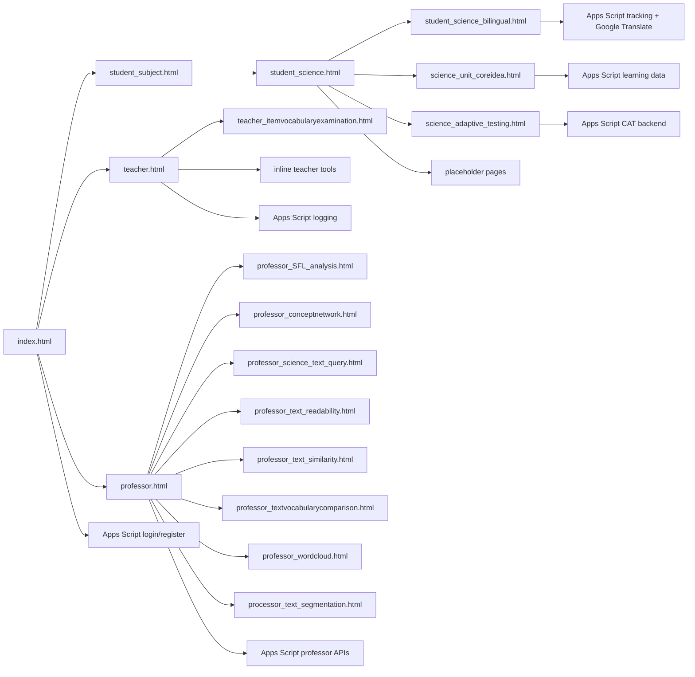

# Architecture

## 1. System Overview

`aischool` 是一個由多個獨立靜態 HTML 頁面組成的網站，沒有 bundler、沒有 shared source directory、沒有正式的 component system。每一頁通常都同時包含：

- 結構 HTML
- Tailwind config
- 自訂 CSS
- 內嵌 JavaScript
- 與外部 GAS 或第三方服務的整合

## 2. Runtime Shape

## 3. Page Families

### Entry And Auth

- `index.html`
  - 首頁
  - 角色卡片
  - 登入/註冊 modal
  - 依 `currentUser.role` 導向學生、教師或教授頁
  - 直接呼叫 GAS 做 login/register

### Student

- `student_subject.html`
  - 學生入口 hub
  - 科目分流頁
- `student_science.html`
  - 自然科工具 hub
  - 導向閱讀、核心概念、適性測驗與其他延伸模組
- `student_science_bilingual.html`
  - 雙語閱讀/語音/翻譯/追蹤
  - 有開發用登入 bypass
- `science_unit_coreidea.html`
  - 單元核心概念與互動內容
- `science_adaptive_testing.html`
  - CAT 測驗頁
- Placeholder pages
  - `science_cap.html`
  - `science_csat.html`
  - `science_virtural_lab.html`
  - `student_chinese.html`
  - `student_english.html`
  - `student_keyidea.html`
  - `student_math.html`
  - `student_society.html`

### Teacher

- `teacher.html`
  - 教師儀表板
  - 部分工具在頁內切 view
  - 部分工具直接導到獨立頁
- `teacher_itemvocabularyexamination.html`
  - 命題用語檢核
- `teacher_CAT_review.html`
  - 教學檢視相關頁面

### Professor

- `professor.html`
  - 教授入口 hub
  - 教授登入
  - 多個工具頁導航
  - 內建一些 inline tool
- Dedicated professor tools
  - `professor_SFL_analysis.html`
  - `professor_conceptnetwork.html`
  - `professor_science_text_query.html`
  - `professor_text_readability.html`
  - `professor_text_similarity.html`
  - `professor_textvocabularycomparison.html`
  - `professor_wordcloud.html`
  - `processor_text_segmentation.html`

## 4. State Model

### Session

主登入資訊多數使用：

- `sessionStorage.currentUser`

主入口頁與部分 professor 子頁現在會優先透過 `assets/js/aischool-shared.js` 讀寫這個 key。

但實際上還有其他 key：

- `sessionStorage.isLoggedIn`
- `sessionStorage.redirectMsg`
- `sessionStorage.last_professor_feature`
- `sessionStorage.wordcloud_context`

### Language

目前語言設定 key 不統一，至少有：

- `AI_SCHOOL_LANG`
- `slh_lang`
- `appLang`

這代表語系調整不是全站單一設定，而是頁面各自管理。

不過主入口頁現在已透過 `assets/js/aischool-shared.js` 同步寫入統一 key `AISCHOOL_LANG` 與舊 key，作為相容過渡。

## 5. External Dependencies

### CDN Libraries

常見依賴包括：

- Tailwind CSS CDN
- Font Awesome CDN
- Chart.js CDN
- Cytoscape 與 layout plugin
- Google Fonts

### External Services

- 多個 Google Apps Script Web App endpoint
- Google Translate widget
- Google Translate 非正式 HTTP endpoint

## 6. Backend Topology

本 repo 沒有內建 server code，後端全靠外部 Apps Script。

重要事實：

- `assets/js/aischool-shared.js` 現在負責共用的 session、flash 與語言 key 行為，但尚未覆蓋全站所有頁面。
- 不是所有頁面共用同一個 GAS URL
- 不同功能常綁定不同部署
- 某些頁面使用 `mode: "cors"`
- 某些 logging 或 tracking 使用 `mode: "no-cors"`

這代表若要做正式維運，GAS endpoint 應視為架構資產，而不是頁面私有常數。

## 7. Navigation And Flow

### Flow A: Login And Role Routing

1. 使用者在 `index.html` 登入或註冊
2. 前端發送 JSON 到 GAS
3. 成功後把 user 存進 `sessionStorage.currentUser`
4. 依角色導向：
   - student -> `student_subject.html`
   - teacher -> `teacher.html`
   - professor -> `professor.html`

### Flow B: Student Science

1. `student_subject.html` 選自然科
2. 進到 `student_science.html`
3. 再導向：
   - `student_science_bilingual.html`
   - `science_unit_coreidea.html`
   - `science_adaptive_testing.html`
   - 或 placeholder 頁

### Flow C: Teacher Hub

1. `teacher.html` 顯示 dashboard
2. 部分工具在頁內切換 view
3. 部分工具直接導向獨立頁
4. 工具使用行為透過 GAS logging 記錄

### Flow D: Professor Hub

1. `professor.html` 驗證教授登入
2. 入口頁維護 feature usage、logout survey、部分 inline tool
3. 專門分析工具導向獨立頁
4. 多個教授工具頁會檢查 `sessionStorage.currentUser`

## 8. Current Risks

- 空白 placeholder 頁很多，但仍存在正式導航入口。
- 多個 GAS URL 分散在不同頁，變更成本高且容易漏改。
- `DEV_BYPASS_LOGIN = true` 代表某些學生頁在開發模式下可跳過登入。
- session 與 language key 命名不一致，容易造成跨頁狀態漂移。
- 某些 API fallback 使用 `no-cors`，只能 fire-and-forget，失敗可觀測性有限。
- `professor/researcher` 命名漂移可能在 role 判斷時踩坑。
